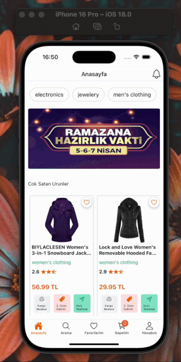

# Trendyol Clone Project

This is a Trendyol Clone project developed with React Native and TypeScript. Users can browse products, add them to their favorites, add products to the cart, and view profile information by logging in.

## Project Purpose

With this project, I aimed to implement the core features of an e-commerce app on React Native using TypeScript, and practice the following concepts:

- Data management with Redux Toolkit
- API usage and data fetching
- Setting up navigation structure
- Simulating real user flows

## Features

- Listing products and product detail page
- Filtering by category
- Popular and best-selling product lists
- Adding products to favorites
- Adding products to the cart
- User login and profile page
- Storing tokens with AsyncStorage
- State management with Redux Toolkit
- Fake Store API integration

## Technologies Used

- React Native
- Redux Toolkit
- React Navigation
- TypeScript
- Axios
- AsyncStorage
- Fake Store API

## API Source

- [Fake Store API](https://fakestoreapi.com/)

## ScreenShot

